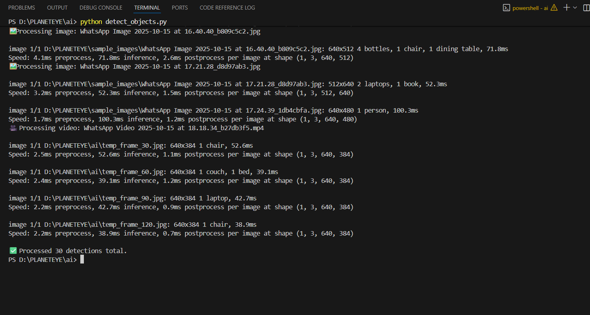

# 🎯 AI-Powered Object Detection & Data Logging System

A comprehensive system that uses AI to detect objects from images and videos, stores all detection data in PostgreSQL database, and provides a web-based dashboard for real-time monitoring and analysis.

## 📋 Table of Contents
- [Features](#features)
- [Technology Stack](#technology-stack)
- [System Architecture](#system-architecture)
- [Installation](#installation)
- [Usage](#usage)
- [Database Schema](#database-schema)
- [Web Dashboard](#web-dashboard)
- [API Endpoints](#api-endpoints)
- [Screenshots](#screenshots)
- [Project Structure](#project-structure)
- [Contributing](#contributing)

## ✨ Features

### 🔍 AI Object Detection
- **YOLOv8** integration for real-time object detection
- Support for **images** (.jpg, .jpeg, .png)
- Support for **videos** (.mp4, .avi, .mov, .mkv)
- Processes video frames automatically (every 30th frame)
- Confidence score filtering (>50%)

### 🗄️ Database Management
- **PostgreSQL** database with normalized schema
- Stores object names, confidence scores, timestamps, coordinates
- Optimized indexes for fast queries
- Batch data insertion capability
- Location simulation (NYC area coordinates)

### 🌐 Web Dashboard
- Real-time web interface at `http://localhost:5000`
- Auto-refresh every 10 seconds
- Object detection summary with counts
- Recent detections table
- Manual refresh button
- Responsive design

### 📊 Data Analysis
- SQL queries for detection statistics
- Object type analysis
- Confidence score analysis
- Time-based filtering
- Location-based queries

## 🛠️ Technology Stack

### Backend
- **Python 3.8+**
- **YOLOv8** (Ultralytics) - AI Object Detection
- **OpenCV** - Image/Video Processing
- **PostgreSQL** - Database
- **psycopg2** - Database Connector

### Frontend
- **Flask** - Web Framework
- **HTML5/CSS3** - Web Interface
- **JavaScript** - Auto-refresh functionality

### Libraries & Dependencies
```
ultralytics==8.0.196    # YOLOv8 AI model
opencv-python==4.8.1.78 # Image/video processing
psycopg2-binary==2.9.7  # PostgreSQL connector
flask==2.3.3            # Web framework
pillow==10.0.1          # Image processing
pandas==2.1.1           # Data analysis
numpy==1.24.3           # Numerical computing
```

## 🏗️ System Architecture

```
┌─────────────────┐    ┌──────────────────┐    ┌─────────────────┐
│   Images/Videos │───▶│   YOLOv8 AI      │───▶│   PostgreSQL    │
│   Input Files   │    │   Detection      │    │   Database      │
└─────────────────┘    └──────────────────┘    └─────────────────┘
                                │                        │
                                ▼                        ▼
┌─────────────────┐    ┌──────────────────┐    ┌─────────────────┐
│   Web Dashboard │◀───│   Flask Web App  │◀───│   Data Analysis │
│   (Browser UI)  │    │   (localhost:5000)│    │   & Queries     │
└─────────────────┘    └──────────────────┘    └─────────────────┘
```

## 📦 Installation

### Prerequisites
1. **Python 3.8+** installed
2. **PostgreSQL** installed and running
3. **Git** (for cloning)

### Step 1: Clone Repository
```bash
git clone https://github.com/yourusername/planeteye-ai-detection.git
cd planeteye-ai-detection
```

### Step 2: Install Dependencies
```bash
pip install -r requirements.txt
```

### Step 3: PostgreSQL Setup
1. Install PostgreSQL from [postgresql.org](https://www.postgresql.org/download/)
2. Create database:
```sql
CREATE DATABASE planeteye;
```
3. Update database password in `database/config.py`:
```python
DB_CONFIG = {
    'password': 'your_postgres_password_here'
}
```

### Step 4: Initialize Database
```bash
cd database
python setup_db.py
```

## 🚀 Usage

### Quick Start (with sample data)
```bash
# Generate sample detection data
python sample_data_generator.py

# Start web dashboard
python start_web_ui.py

# Open browser: http://localhost:5000
```

### AI Object Detection

#### For Images
```bash
# Add images to sample_images/ folder
# Run detection
cd ai
python detect_objects.py
```

#### For Videos
```bash
# Add video files (.mp4, .avi, .mov) to sample_images/ folder
# Run detection (automatically processes both images and videos)
cd ai
python detect_objects.py
```

### Web Dashboard
```bash
# Start web interface
python start_web_ui.py

# Access at: http://localhost:5000
# Auto-refreshes every 10 seconds
# Manual refresh button available
```

### Data Analysis
```bash
# View detection statistics
python show_detected_objects.py

# View detailed data
python view_data.py

# Run SQL analysis
cd analysis
python queries.py
```

## 🗃️ Database Schema

### Tables

#### `object_types` (Lookup Table)
```sql
type_id    SERIAL PRIMARY KEY
type_name  VARCHAR(50) UNIQUE NOT NULL
```

#### `detections` (Main Table)
```sql
object_id        SERIAL PRIMARY KEY
type_id          INTEGER REFERENCES object_types(type_id)
object_name      VARCHAR(50)           -- Direct object name storage
confidence_score DECIMAL(5,4)          -- AI confidence (0.0-1.0)
timestamp        TIMESTAMP WITH TIME ZONE
latitude         DECIMAL(10,8)         -- GPS coordinates
longitude        DECIMAL(11,8)         -- GPS coordinates
image_reference  VARCHAR(255)          -- Source file path
```

### Indexes (Optimized for Fast Queries)
- `idx_detections_type_id` - Object type filtering
- `idx_detections_timestamp` - Time-based queries
- `idx_detections_location` - Location-based queries
- `idx_detections_confidence` - Confidence sorting

### Database Views
```sql
-- Easy object viewing
SELECT * FROM detected_objects;

-- Object statistics
SELECT * FROM object_summary;
```

## 🌐 Web Dashboard

### Features
- **Real-time Updates**: Auto-refresh every 10 seconds
- **Object Summary**: Detection counts by object type
- **Recent Detections**: Latest 50 detections with details
- **Confidence Scores**: Percentage display
- **Responsive Design**: Works on desktop and mobile

### URLs
- Main Dashboard: `http://localhost:5000`
- Auto-refresh: Enabled by default
- Manual refresh: Click "Refresh Now" button

## 📡 API Endpoints

### Flask Routes
```python
GET /                    # Main dashboard
GET /api/detections     # JSON API (future enhancement)
GET /api/summary        # Summary statistics (future enhancement)
```

## 📸 Screenshots

### 1. Web Dashboard Overview

*Main dashboard showing object detection summary and recent detections*

### 2. Object Detection Summary

*Detection counts by object type with confidence scores*

### 3. Recent Detections Table

*Latest detections with timestamps and source images*

### 4. AI Detection Process

*YOLOv8 processing images and videos*

### 5. Database View (PostgreSQL)

*PostgreSQL database showing stored detection data*

### 6. Command Line Output

*Terminal showing detection process and results*

## 📁 Project Structure

```
PLANETEYE/
├── ai/
│   ├── detect_objects.py          # Main AI detection script
│   └── yolov8n.pt                # YOLOv8 model weights
├── database/
│   ├── config.py                 # Database configuration
│   ├── db_operations.py          # Database operations class
│   ├── schema.sql                # Database schema
│   ├── setup_db.py               # Database initialization
│   └── create_detected_objects_view.sql
├── web/
│   ├── app.py                    # Flask web application
│   └── templates/
│       └── dashboard.html        # Web dashboard template
├── analysis/
│   └── queries.py                # SQL analysis queries
├── sample_images/                # Input images/videos folder
├── screenshots/                  # Documentation screenshots
├── requirements.txt              # Python dependencies
├── requirements_web.txt          # Web-specific dependencies
├── sample_data_generator.py      # Generate test data
├── show_detected_objects.py      # View detection results
├── view_data.py                  # Database data viewer
├── start_web_ui.py              # Web UI launcher
├── quick_demo.py                # Quick system demo
└── README.md                    # This file
```

## 🎯 Supported Object Types

The system can detect 80+ object types including:
- **People**: person
- **Vehicles**: car, truck, bus, bicycle, motorcycle
- **Electronics**: laptop, tv, cell phone
- **Furniture**: chair, couch, bed, dining table
- **Items**: handbag, book, bottle, clock
- **Animals**: cat, dog, bird, horse, cow, sheep
- **And many more...**

## 📊 Sample Detection Results

```
DETECTED OBJECT TYPES:
========================================
* person          : 272 detections
* bus             : 107 detections  
* bicycle         : 105 detections
* car             :  99 detections
* truck           :  93 detections
* laptop          :   5 detections
* tv              :   3 detections
* chair           :   2 detections
* handbag         :   1 detection
```

## 🔧 Configuration

### Database Configuration (`database/config.py`)
```python
DB_CONFIG = {
    'host': 'localhost',
    'database': 'planeteye',
    'user': 'postgres',
    'password': 'your_password_here',
    'port': 5432
}
```

### AI Model Configuration
- Model: YOLOv8n (nano - fastest)
- Confidence Threshold: 0.5 (50%)
- Video Frame Processing: Every 30th frame
- Supported Formats: JPG, PNG, MP4, AVI, MOV, MKV

## 🚀 Performance

### Processing Speed
- **Images**: ~70ms per image
- **Videos**: ~40ms per frame
- **Database Queries**: Sub-second response
- **Web Dashboard**: Real-time updates

### Scalability
- Handles multiple images/videos in batch
- Optimized database indexes
- Efficient memory usage
- Configurable processing intervals

## 🔮 Future Enhancements

- [ ] Real-time camera feed processing
- [ ] GPS integration for actual coordinates
- [ ] Advanced analytics dashboard
- [ ] REST API endpoints
- [ ] Docker containerization
- [ ] Cloud deployment support
- [ ] Mobile app integration
- [ ] Advanced filtering options

## 🤝 Contributing

1. Fork the repository
2. Create feature branch (`git checkout -b feature/AmazingFeature`)
3. Commit changes (`git commit -m 'Add AmazingFeature'`)
4. Push to branch (`git push origin feature/AmazingFeature`)
5. Open Pull Request

## 📄 License

This project is licensed under the MIT License - see the [LICENSE](LICENSE) file for details.

## 👨‍💻 Author

**Vikas**
- GitHub: [@yourusername](https://github.com/yourusername)
- Email: your.email@example.com

## 🙏 Acknowledgments

- **Ultralytics** for YOLOv8 model
- **PostgreSQL** team for robust database
- **Flask** community for web framework
- **OpenCV** for computer vision tools

---

⭐ **Star this repository if you found it helpful!**